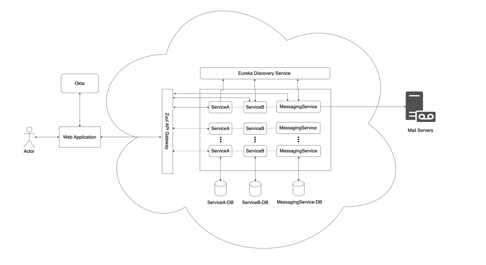
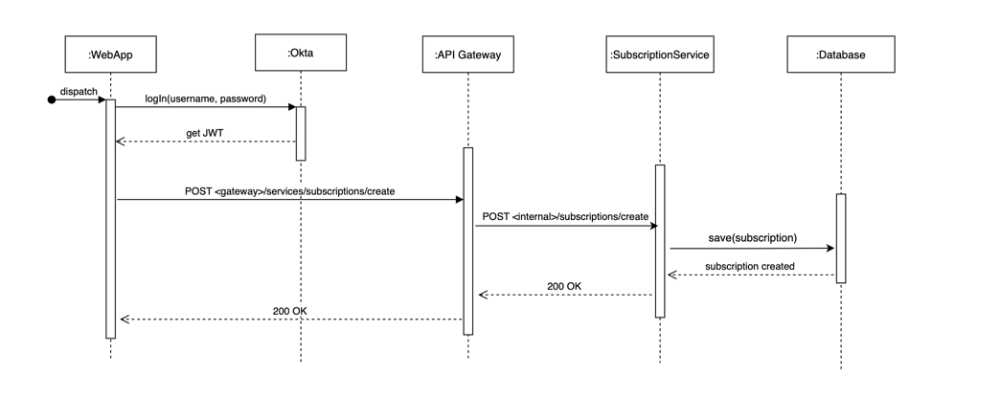
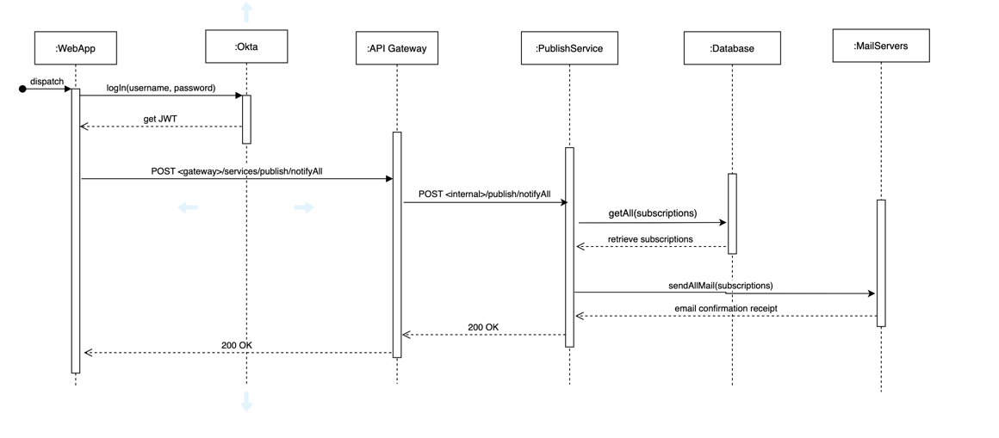

# Promotions-Messaging Microservice 

This application follows a microservices architecture design in Spring Boot. The purpose of
this application is to mimic a promotions service such that users of an eCommerce web application
can subscribe to future sales and receive emails on such promotions when they are available.

### High-Level Architecture
- Web application in our demonstration is substituted via Postman to make API calls to 
the promotions services.
- Utilized Netflix's Zuul API gateway and Eureka service discovery SDKs to implement
our architectural style
  - Zuul - used for load balancing requests, authentication, filtering, metrics, etc.
  - Eureka - service discovery server to register clients for simpler internal communication
- In an enterprise environment, services are containerized in a container managed platform (such as Kubernetes) to handle
incoming traffic at scale. This approach also reduces latency and maintains high availability
- In enterprise environment, should utilize a highly secure identity management service such as 
Okta for ensuring security for the system (currently use basic auth for demonstration purposes)
- Utilized a MySQL database to ensure ACID properties are present for every transaction

### Sequence Diagrams
#### Create Subscription Workflow

#### Publish Sale Workflow

